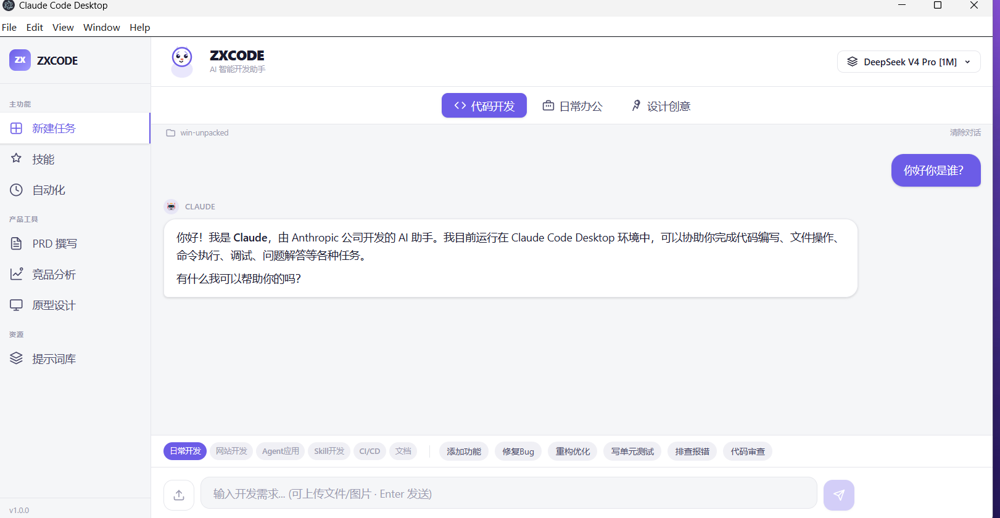

# Claude Code Desktop

> 将 Claude Code CLI 封装为桌面应用，保留全部 CLI 功能，并集成 PRD 撰写、竞品分析、原型设计、实时流量监控仪表盘、自动化调度引擎、提示词库等产品工具。


<p align="center">
  
  
  
  
  
  
  
  
  
  
</p>

---

## ✨ 功能

### 核心功能

| 功能 | 说明 |
|---|---|
| **Claude Code 完整终端** | PTY 虚拟终端，100% 保留 CLI 全部能力（MCP 工具、插件、Hooks、/model 命令） |
| **AI Chat 对话界面** | 结构化消息列表 + 流式输出 + 文件/图片上传 + 工作目录上下文注入 |
| **多标签终端** | 不同目录并行运行多个 Claude Code 会话，支持自定义目录启动 |

### 流量监控仪表盘

| 功能 | 说明 |
|---|---|
| **实时数据采集** | 每 2 秒解析 `~/.claude/projects/*/session.jsonl`，无需额外配置 |
| **Token 统计** | 总请求数、Input/Output/Cache 读/Cache 写 Token 分项统计 |
| **缓存命中率** | 环形仪表盘 + 趋势折线图，实时展示缓存效率 |
| **Token 流向图** | 按模型分组的堆叠柱状图（Input/Output/Cache 读/Cache 写） |
| **模型占比饼图** | 各模型 Token 用量占比可视化 |
| **请求日志表** | 最近 50 条请求明细：时间、模型、Input、Output、Cache 读、命中率、耗时、HTTP 状态 |
| **费用估算** | 多提供商定价（DeepSeek/GLM/Qwen/Moonshot/MiniMax/Claude），自动匹配当前模型费率 |
| **工具栏集成** | 底部工具栏一键开关监控面板，紧凑模式显示 Token 总量/命中率/费用 |

### 产品工具

| 功能 | 说明 |
|---|---|
| **PRD 撰写** | AI 辅助生成可开发级产品需求文档，含业务规则、交互逻辑、验收标准 |
| **竞品分析** | 多维度竞品分析报告，支持 SWOT、波特五力、用户体验地图等框架 |
| **原型设计** | 一句话需求生成 HTML 交互原型，内置 **UI-UX-Pro-Max 设计系统**（20+ 设计规则：无障碍、响应式、动画、字体色板、表单反馈等），自动优化 UI |
| **项目测试** | AI 自动测试与迭代改进完整项目，支持所有语言（Web/Python/Node/Java/Go 等），自动备份/回滚，完整源码浏览 + 语法高亮 + 修改前后对比，内置 HTTP 服务器联动预览整个项目效果 |
| **提示词库** | 精选 12+ 高频场景 Prompt 模板（PRD/竞品/用户故事/技术评估等），支持自定义 |
| **技能管理** | 浏览和管理 AI 技能插件 |

#### 工具页增强（v1.0.1）

| 功能 | 说明 |
|---|---|
| **表单持久化** | 页面切换时自动保存表单内容（300ms 防抖），新建任务立即清空 |
| **多格式导出** | 支持复制、下载 .md / .docx / .pdf、浏览器中打开（HTML 原型） |
| **HTML 自动提取** | 4 阶段智能提取：`<!DOCTYPE html>... </html>` → `<html>... </html>` → markdown 代码块 → 原始回退，确保导出内容不含 AI 注释 |
| **源码/预览切换** | HTML 模式支持源码视图（语法高亮）和预览视图（全宽 iframe）；Markdown 模式渲染格式化文档 |
| **AI 润色** | 需求描述一键润色，最小化改动保留原始细节 |
| **历史记录** | 自动保存生成记录，支持查看和恢复历史内容 |
| **思考动画** | 生成过程中显示 SVG 动画（跳动圆点 / 波纹），替代空白等待 |
| **应用重启清空** | 启动时自动清理临时表单和流式输出缓存，确保每次启动都是全新状态 |

### 自动化调度引擎

| 功能 | 说明 |
|---|---|
| **12 个预设模板** | 每日 AI 新闻、英语单词、睡前故事、周报、电影推荐、历史上的今天等 |
| **三种执行频率** | 单次执行 / 每天定时 / 按间隔循环（精确到分钟） |
| **自动执行** | 到点自动创建终端 → 发送 Prompt → 自动切换到对应标签页 |
| **持久化存储** | 任务配置保存到 `~/.claude/automation-tasks.json`，重启自动恢复 |

### 微信机器人 (WeChat ClawBot)

| 功能 | 说明 |
|---|---|
| **iLink 协议接入** | 基于微信官方 ilinkai.weixin.qq.com REST API，无需破解微信客户端 |
| **扫码登录** | 本地生成 QR 码 SVG（无需外部 API），手机扫码自动连接 |
| **自动重连** | 持久化 Token + UIN + Cursor，重启应用自动恢复连接 |
| **AI 对话路由** | 微信消息通过本地 AI 管道处理，支持 6 种 Bot 人设（助手/翻译/代码/诗人/分析师/梗图达人） |
| **语音消息** | SILK → WAV 解码 + 时长提取（需 `silk-wasm`） |
| **视频消息** | MP4/MOV 元数据解析（时长/分辨率/格式） |
| **开机自启** | 用户登录后静默启动（VBS 后台调用，不弹窗） |

### 本地多模态视觉（🆕 Qwen3.5-9B VLM）

支持**图片识别**，图片通过本地的 **Qwen3.5-9B VLM**（llama.cpp 运行）分析后，将文字描述发送给 DeepSeek 等纯文本模型，实现"**零成本多模态**"。

```
用户发送图片 + 文字
    │
    ▼
[检测当前模型是否支持视觉]
    │
    ├── 支持视觉 (Qwen DashScope)
    │   └── 图片+文字 → 直接发送 → AI 回复
    │
    └── 不支持视觉 (DeepSeek 等)
        ├── 图片 → Qwen3.5-9B VLM (本地 F:\llama.cpp) → 中文描述
        ├── 描述 + 用户原文 → DeepSeek → AI 回复
        └── llama.cpp 未运行 → 提示安装指引
```

| 功能 | 说明 |
|---|---|
| **本地推理** | Qwen3.5-9B Q4_K_M (5.29GB) + mmproj (0.86GB)，CPU (AVX2) 运行 |
| **完全免费** | 无需 API Key，无需联网，纯本地推理 |
| **桌面应用集成** | `chat.service.ts` 自动检测模型视觉能力，透明路由 |
| **Claude Code CLI 集成** | `qwen-vision` MCP Server 提供 `analyze_image` / `chat_with_vision` 工具 |
| **开机自启动** | 服务随用户登录静默启动（计划任务） |
| **双端可用** | 桌面应用 + 全局 Claude Code CLI 均可调用 |

> ⚠️ **重要警告：图片处理速度会很慢！**
> 
> Qwen3.5-9B VLM 运行在 **CPU-only** 模式下（Intel Iris Xe 集成显卡不支持 GPU 加速）：
> - **首次推理**：需要 40-60 秒预热（模型加载到内存）
> - **每次图片分析**：30-120 秒（取决于图片大小和复杂度）
> - **停止按钮**：图片分析期间可随时取消（已接入 AbortController）
> 
> 如果有 NVIDIA 独立显卡，可将 `llama-b9701-bin-win-cpu-x64` 替换为 `llama-b9701-bin-win-cuda-12.4-x64`，推理速度可提升 5-10 倍。

### 界面组件

| 功能 | 说明 |
|---|---|
| **左侧导航** | 新任务 / 专家技能 / 自动化 / 提示词库 / PRD / 竞品分析 / 原型设计 |
| **场景标签** | 编程 / 写作 / 分析 / 日常 / 自定义，切换不同 Prompt 模板集 |
| **底部工具栏** | Craft / Auto / 技能 / 连接器 / 权限 / 流量监控开关 + 实时用量指示器 |
| **状态栏** | 上下文窗口使用率进度条、当前模型、Token 用量、费用、会话数、工作目录 |
| **可折叠流量面板** | 右侧面板展示完整监控仪表盘，支持一键折叠/展开 |

---

## 🎬 界面



---

## 🚀 快速开始

### 开发环境

```bash
# 克隆仓库
git clone https://github.com/zxlovefly/claude-code-desktop.git
cd claude-code-desktop

# 安装依赖
npm install

# 开发模式运行
npm run dev

# 构建生产版本
npm run build

# 打包为 EXE (Windows)
npm run package
```

### 直接使用

下载 [Releases](https://github.com/zxlovefly/claude-code-desktop/releases) 中的 `Claude Code Desktop.exe`，双击运行。

---

## 📋 前置要求

- **Node.js** >= 22.x（仅开发时需要）
- **Claude Code CLI** 已安装并可在终端运行（`claude` 命令可用）
  - 安装：`npm install -g @anthropic-ai/claude-code`
- Windows 10+ / macOS 12+ / Linux

> 🔔 如果未安装 Claude Code CLI，桌面端启动后会显示红色提示条。

### 本地多模态视觉（可选）

如需使用图片识别功能，需要部署本地 Qwen3.5-9B VLM 模型：

```batch
# 1. 下载 llama.cpp (Windows CPU 版)
#    从 https://github.com/ggml-org/llama.cpp/releases 下载最新版
#    解压到 F:\llama.cpp\bin\

# 2. 下载 Qwen3.5-9B VLM GGUF 模型 (~7GB)
#    Q4_K_M 模型 (5.29GB): https://huggingface.co/jc-builds/Qwen3.5-9B-VLM-Q4_K_M-GGUF
#    mmproj F16 (0.86GB): 同上仓库
#    存放位置: F:\llama.cpp\models\

# 3. 启动模型服务
F:\llama.cpp\start-server.bat

# 4. 验证
curl http://localhost:8080/health
```

> ⚠️ 模型服务会在每次系统登录后**自动启动**（已配置开机自启 VBS 脚本）。
> 
> ⚠️ **图片识别非常慢**：纯 CPU 推理，每次分析需 30-120 秒。如有 NVIDIA 显卡请使用 CUDA 版 llama.cpp。

---

## ⚠️ 重要提醒：模型切换功能已移除

**请不要使用本应用进行模型切换操作。** 早期版本包含内置的模型切换 UI，但在实际使用中可能出现以下问题：

### 可能出现的 Bug

| 问题 | 触发条件 |
|---|---|
| **切换到其他厂商后无法切回原厂商** | key 解析回退链可能读取正在修改中的 `env` 副本，导致跨厂商的 `ANTHROPIC_AUTH_TOKEN` 污染 |
| **在 Sidebar 配置 Key 后模型列表不更新** | `handleSetApiKey()` 只调用了 `config:set` 写入 `settings.json`，没写入 `keys.json` |
| **自动化执行卡死** | auto-send 路径下直接调用 `chat:send-message` 可能与正在进行的 stream 产生竞态条件 |
| **切页面后 prompt 重复填充** | auto-send 路径不经过 ChatInput 的 `onConsumed()`，`filledPrompt` 未被清空 |
| **Chat Service key 解析拿到错误的 Key** | `getApiConfig()` 找不到 `keys.json[providerId]` 时回退到 `env.ANTHROPIC_AUTH_TOKEN` |

### 建议做法

**如需切换模型，请直接编辑 `~/.claude/settings.json`：**

```json
{
  "env": {
    "ANTHROPIC_BASE_URL": "https://api.deepseek.com/anthropic",
    "ANTHROPIC_MODEL": "deepseek-v4-pro",
    "ANTHROPIC_AUTH_TOKEN": "sk-your-api-key-here"
  }
}
```

或者使用 Claude Code CLI 自带的 `/model` 命令在终端内切换：

```
/model deepseek-v4-flash
```

> ⚡ 本应用仅保留模型名称的**只读展示**（顶部栏和状态栏），所有切换入口已被移除。

---

## 🤖 自动化调度

### 预设模板

| 模板 | 默认频率 |
|---|---|
| 📰 每日 AI 新闻推送 | 每天 08:00 |
| 📝 每日 5 个英语单词 | 每天 09:00 |
| 🌙 每日儿童睡前故事 | 每天 20:30 |
| 📊 每周工作周报 | 每天 17:00 |
| 🎬 经典电影推荐 | 每天 12:00 |
| 📅 历史上的今天 | 每天 07:00 |
| ❓ 每日一个为什么 | 每天 10:00 |
| 📞 父母联系提醒 | 每天 10:00 |
| 🏥 体检预约提醒 | 单次 |
| 💼 面试准备提醒 | 每 120 分钟 |
| 📋 会议前准备 | 每天 08:30 |
| 🐱 可爱萌宠手机壁纸 | 每天 06:00 |

### 自定义任务

支持三种执行频率：

- **单次**：指定日期+时间执行一次，不填时间则立即执行
- **每天**：每日定时执行，到点自动创建终端发送 prompt
- **按间隔**：每隔 N 分钟循环执行

所有任务持久化到 `~/.claude/automation-tasks.json`，应用重启后自动恢复。

### 调度原理

采用 `setTimeout` 精确计算目标时间的毫秒差，到点即触发，不依赖轮询。

```
添加任务 → computeDelay() → msUntil(目标时间) → setTimeout
                              ↓
                         到点触发 executeTask()
                              ↓
                    主进程 emit('executed')
                              ↓
                    App.tsx 监听 → 创建终端 → 发送 prompt → 自动切标签
```

---

## 📊 流量监控仪表盘

### 数据采集

应用启动后自动开始监控，每 2 秒扫描 `~/.claude/projects/*/session.jsonl` 文件（Claude Code CLI 自动维护的会话日志），提取每次 API 调用的 Token 使用数据。

### 可视化图表

| 图表 | 类型 | 说明 |
|---|---|---|
| 环形仪表盘 | Canvas | 缓存命中率实时仪表，绿/黄/红三色区间 |
| 堆叠柱状图 | Canvas | 按模型分组的 Token 流向（Input/Output/Cache 读/Cache 写） |
| 趋势折线图 | Canvas | 最近 30 次请求的缓存命中率变化趋势 |
| 模型占比饼图 | Canvas | 各模型 Token 用量占比，自动标注百分比 |
| 请求日志表 | HTML Table | 最近 50 条请求的完整明细 |

### 费用估算

根据模型名称自动匹配定价策略，支持以下提供商的 CN¥/百万 Token 定价：

| 提供商 | Input | Cache Hit | Cache Write | Output |
|---|---|---|---|---|
| DeepSeek | ¥2.00 | ¥0.25 | ¥4.00 | ¥8.00 |
| GLM (智谱) | ¥5.00 | ¥1.00 | ¥5.00 | ¥20.00 |
| Qwen (通义千问) | ¥3.50 | ¥0.70 | ¥3.50 | ¥14.00 |
| Moonshot | ¥12.00 | ¥3.00 | ¥12.00 | ¥12.00 |
| MiniMax | ¥5.00 | ¥1.00 | ¥5.00 | ¥15.00 |
| Claude (Anthropic) | $3.00 × 7.2 | $0.375 × 7.2 | $3.75 × 7.2 | $15.00 × 7.2 |

### 使用方式

- **工具栏**：底部工具栏实时显示 Token 总量、缓存命中率、预估费用，点击"流量"按钮开关右侧仪表盘
- **仪表盘面板**：右侧面板展示完整图表和请求日志，支持折叠为图标模式
- **状态栏**：底部状态栏显示上下文窗口使用率、模型、Token、费用

---

## 🛠️ 技术栈

| 层 | 技术 |
|---|---|
| 桌面框架 | Electron 35 |
| UI | React 19 + TypeScript + Tailwind CSS 4 |
| 终端 | xterm.js + node-pty |
| 布局 | allotment (VS Code 风格分栏) |
| 状态管理 | Zustand 5 |
| Canvas 图表 | 原生 Canvas 2D API（环形仪表/柱状图/折线图/饼图） |
| 构建 | electron-vite + electron-builder |
| 调度引擎 | 内置 setTimeout 精确到秒 |
| 本地 LLM | llama.cpp b9701 (CPU/AVX2) |
| 多模态模型 | Qwen3.5-9B VLM (Q4_K_M GGUF + mmproj F16) |
| 语音解码 | silk-wasm (SILK → WAV) |
| MCP 协议 | @modelcontextprotocol/sdk (stdio transport) |

---

## 📂 项目结构

```
src/
├── main/                              # Electron 主进程
│   ├── index.ts                       # 窗口创建、生命周期
│   ├── ipc.ts                         # IPC 通信注册
│   └── services/
│       ├── terminal.service.ts        # PTY 终端管理（多会话）
│       ├── model.service.ts           # 模型信息读取（只读）
│       ├── proxy.service.ts           # 流量监控（解析 JSONL + 多提供商定价）
│       ├── chat.service.ts            # AI Chat 对话服务（含多模态视觉路由）
│       ├── config.service.ts          # 配置管理
│       ├── scheduler.service.ts       # 自动化调度引擎
│       └── wechat-bot.service.ts      # 微信机器人（iLink 协议）
├── preload/                           # 安全通信桥
│   └── index.ts
├── renderer/                          # React UI
│   ├── App.tsx                        # 根组件（路由 + 布局 + IPC 事件）
│   ├── main.tsx                       # React 入口
│   ├── styles/
│   │   └── global.css                 # Tailwind + 设计 Token + 动画
│   ├── components/
│   │   ├── Terminal/                  # xterm.js 终端 + 多标签页
│   │   │   ├── TerminalView.tsx       # 终端视图
│   │   │   └── TerminalTabs.tsx       # 标签页组件
│   │   ├── Chat/                      # AI Chat 界面
│   │   │   ├── ChatTerminalView.tsx   # 聊天主视图（消息列表 + 输入框 + 模板）
│   │   │   ├── ChatInput.tsx          # 输入框（文本/文件/图片上传）
│   │   │   ├── MessageList.tsx        # 消息列表
│   │   │   ├── AssistantMessage.tsx   # AI 回复（Markdown 渲染）
│   │   │   └── UserMessage.tsx        # 用户消息
│   │   ├── Sidebar/                   # 侧边栏
│   │   │   ├── Sidebar.tsx            # 右侧面板容器（可折叠）
│   │   │   ├── TrafficMonitor.tsx     # 流量监控仪表盘（Canvas 图表 + 日志表）
│   │   │   ├── AutomationPanel.tsx    # 自动化调度面板
│   │   │   └── LeftNav.tsx            # 左侧导航（页面切换）
│   │   ├── Main/                      # 主区域组件
│   │   │   ├── BottomToolbar.tsx      # 底部工具栏（工具按钮 + 流量开关 + 实时用量）
│   │   │   ├── ScenarioTabs.tsx       # 场景标签页
│   │   │   └── PromptTemplates.tsx    # Prompt 模板选择器
│   │   ├── Pages/                     # 产品工具页
│   │   │   ├── PrdPage.tsx            # PRD 撰写
│   │   │   ├── AnalysisPage.tsx       # 竞品分析
│   │   │   ├── PrototypePage.tsx      # 原型设计
│   │   │   ├── SkillsPage.tsx         # 技能管理
│   │   │   ├── PromptLibraryPage.tsx  # 提示词库
│   │   │   ├── ProjectTestPage.tsx   # 项目测试（AI 自动测试 + 迭代改进 + 源码预览 + 项目联动预览）
│   │   │   ├── WechatBotPage.tsx      # 微信机器人管理页
│   │   │   └── ToolPage.tsx           # 工具页通用布局
│   │   ├── StatusBar/                 # 底部状态栏
│   │   │   └── StatusBar.tsx          # 上下文窗口 / 模型 / Token / 费用
│   │   └── Icons.tsx                  # SVG 图标组件
│   └── stores/                        # Zustand 状态管理
│       ├── sessionStore.ts            # 终端会话状态
│       ├── chatStore.ts               # 聊天消息状态
│       ├── monitorStore.ts            # 流量监控数据状态
│       ├── toolStore.ts               # 工具页状态
│       └── wechatBotStore.ts          # 微信机器人状态
├── shared/                            # 共享类型定义
│   ├── types.ts
│   ├── wechat-types.ts                # 微信机器人协议类型
│   └── bot-personas.ts                # 机器人人设模板 (6 种)
└── scripts/
    └── qwen-vision-mcp.mjs            # Qwen 视觉 MCP Server (Claude Code CLI 用)
```

---

## 🏗️ 构建 & 打包

```bash
# 构建
npm run build

# 打包为 Windows 便携版
npm run package

# 输出
# dist/win-unpacked/Claude Code Desktop.exe  (~290MB)
```

---

## 🔧 配置说明

### 模型配置

模型信息（名称、服务商）从 `~/.claude/settings.json` 中的 `env.ANTHROPIC_MODEL` 和 `env.ANTHROPIC_BASE_URL` 读取并只读展示。

本应用**不支持 UI 切换模型**。如需切换，请使用以下方式之一：

**方式一：使用 Claude Code CLI 自带的 `/model` 命令**
在终端中输入：
```
/model deepseek-v4-flash
```

**方式二：直接编辑 `~/.claude/settings.json`**
```json
{
  "env": {
    "ANTHROPIC_BASE_URL": "https://api.deepseek.com/anthropic",
    "ANTHROPIC_MODEL": "deepseek-v4-pro",
    "ANTHROPIC_AUTH_TOKEN": "sk-your-api-key"
  }
}
```

### Claude Code CLI 全局多模态配置

在 `~/.claude/.mcp.json` 中配置 `qwen-vision` MCP Server：

```json
{
  "mcpServers": {
    "qwen-vision": {
      "command": "node",
      "args": ["path/to/scripts/qwen-vision-mcp.mjs"],
      "env": {
        "LLAMA_URL": "http://localhost:8080",
        "QWEN_MODEL": "qwen3.5-9b"
      }
    }
  }
}
```

配置后在 Claude Code CLI 中可使用：
- `analyze_image` — 分析单张图片内容
- `chat_with_vision` — 多图片+文本对话

> 💡 `~/.claude/providers.json` 中已配置 `llama.cpp` 提供商，桌面应用可在模型切换器中直接选择。

### 自动化任务配置

任务数据存储在 `~/.claude/automation-tasks.json`，可通过左侧导航 → 自动化面板进行可视化管理。

---

## 📋 更新日志

### v1.0.2 (2026-06-19) — 项目测试页面全面重做 & 预览系统增强

**项目测试页 (ProjectTestPage) 全面重做：**
- ✨ **源码/预览双 Tab 系统**：匹配原型设计页面 UX，源码 Tab 展示所有修改文件的完整源代码 + 语法高亮，预览 Tab 通过本地 HTTP 服务器联动预览整个项目
- ✨ **完整源码浏览器**：所有被 AI 修改的文件（JS/TS/Python/HTML/CSS/C/Java/Go 等）以标签页形式展示完整源码，支持文件切换、语法高亮（关键字/字符串/注释/数字/HTML 标签）、一键复制
- ✨ **修改前/后对比**：每个文件支持"修改前"→"修改后"单文件切换和左右并排 Diff 视图，红色删除行 + 绿色新增行
- ✨ **整个项目联动预览**：内置本地 HTTP 静态文件服务器（自动分配端口），预览 Tab 通过 `http://127.0.0.1:<port>/index.html` 加载项目，CSS/JS/图片/字体等全部依赖正确解析，不再只是单个 HTML 的 srcDoc 预览
- ✨ **项目文件浏览器**：预览 Tab 下拉菜单列出所有项目 HTML 文件，index.html 优先，支持切换预览不同页面
- ✨ **自动项目类型检测**：选择项目目录后自动扫描（深度 3），检测 Web/Python/Node/Java/Go/Rust/.NET 等项目类型
- ✨ **自动技能加载**：根据项目类型自动加载对应技能（Web → design-an-interface/prototype/pmaster，Python/Node → diagnose/improve-codebase-architecture），始终加载 qa/review
- ✨ **思考动画同步**：生成过程中使用 ThinkingDots/BrainWave/GearSpin SVG 动画（与 ToolPageLayout 一致），4 秒轮播
- ✨ **工具调用记录**：无文件修改时展示完整 AI 分析输出 + 工具调用统计（读取 X 个文件、列出 Y 个目录、执行 Z 条命令）
- ✨ **系统提示词强化**：新增"⚠️ CRITICAL: You MUST Modify Files"板块，强制 AI 使用 write_file 实际修改代码，并要求每处修改添加行内注释标注

**新增 IPC 接口：**
- ✨ `project:scan` — 项目目录扫描，检测项目类型和文件扩展名
- ✨ `project:read-file` — 读取项目中的文本文件内容
- ✨ `project:list-html-files` — 扫描项目目录列出所有 HTML 文件（按路径排序，index.html 优先）
- ✨ `project:start-preview-server` — 启动本地 HTTP 静态文件服务器（MIME 类型完整、目录浏览、路径遍历防护）
- ✨ `project:stop-preview-server` — 停止预览服务器

**AI 润色增强：**
- ✨ **技能强制注入**：润色时根据项目类型自动加载对应技能内容到 prompt 中（Web 加载 design-an-interface/prototype/pmaster，Python/Node 加载 diagnose/improve-codebase-architecture）
- ✨ **System Prompt 升级**：从保守修改变为专业增强模式（丰富细节、结构化表达、量化目标、补充测试维度、考虑边界情况）
- ✨ **PolishButton 新增 context 属性**：支持传递 pageType 和 projectType 上下文

**Bug 修复：**
- 🐛 修复 `Cannot access 'formatTime' before initialization` TDZ 错误（改为模块级 function 声明）
- 🐛 修复 `Cannot access 'writtenFiles' before initialization` TDZ 错误（派生变量移至 effect 之前声明）
- 🐛 修复 `Cannot access 'hasOutput' before initialization` TDZ 错误（预览服务器 effect 移至 hasOutput 之后）
- 🐛 修复 chat:tool-result IPC 参数不匹配导致工具结果无法填充（5 参数 → 2 参数解构修正）
- 🐛 修复系统提示词列出不存在的工具名称（edit_file/search_files 已移除）
- 🐛 修复 CSP `default-src 'self'` 阻止 iframe 加载 `http://127.0.0.1:*` 预览内容（添加 `frame-src 'self' http://127.0.0.1:*`）
- 🐛 修复 iframe sandbox `allow-same-origin` 与跨域 http:// 加载冲突导致预览卡死
- 🐛 修复预览服务器反复停启导致第二次点击预览卡死（effect 拆分为目录变化重启 + 输出就绪启动）

**技术改进：**
- 🔧 `parseToolInput` 函数解析 write_file/read_file/execute_command/list_directory 四种工具调用
- 🔧 `highlightCode` 函数支持多语言语法高亮（JS/TS/Python/HTML/CSS/C/Java/Go/Rust 关键字 + 字符串 + 注释 + 数字）
- 🔧 `computeDiff` 简单行 diff 算法（公共前缀/后缀裁剪）
- 🔧 `BeforeAfterPreview` 组件支持修改前/后 iframe 切换预览
- 🔧 `DiffView` 组件支持左右并排 diff 视图（可折叠）
- 🔧 预览服务器支持 40+ MIME 类型、目录浏览、路径遍历防护、Access-Control-Allow-Origin
- 🔧 构建命令修正：`vite build` → `electron-vite build`

### v1.0.1 (2026-06-19) — 工具页增强 & Bug 修复

**新增功能：**
- ✨ 多格式导出：支持复制、下载 .md / .docx / .pdf、浏览器中打开 HTML 原型
- ✨ HTML 自动提取：4 阶段智能提取，导出内容自动剥离 AI 注释和 markdown 标记
- ✨ 源码/预览双视图：HTML 模式切换源码（语法高亮）和全宽 iframe 预览
- ✨ 历史记录：自动保存生成记录，支持恢复历史表单和输出
- ✨ 思考动画：生成过程中显示 SVG 动画（跳动圆点），替代空白等待
- ✨ AI 润色按钮：需求描述一键优化，最小化改动保留原始细节
- ✨ 新建任务立即清空：同步写入 localStorage，切换页面不再带回旧内容

**Bug 修复：**
- 🐛 修复中文乱码（双重写入 localStorage 导致的字符重复）
- 🐛 修复源码视图出现 markdown 渲染产物（HTML 源码改用 `escapeHtml`）
- 🐛 修复代码生成中途截断（`max_tokens` 从 16384 → 65536）
- 🐛 修复导出包含 AI 注释文字（"这是为您生成的...", "### 设计特点..."）
- 🐛 修复应用重启自动填充旧内容和创建历史记录
- 🐛 修复 `Cannot access 'isHtmlOutput' before initialization` TDZ 错误
- 🐛 修复原型设计系统提示词被精简导致页面美观度下降（恢复完整 UI-UX-Pro-Max 提示词）
- 🐛 修复 AI 润色过度添加抽象包装（重写润色 prompt 为最小限度保守模式）

**技术改进：**
- 🔧 `usePersistedForm` 新增 `resetForm()` 返回同步写入初始值
- 🔧 `useToolStream` 本地 delta 监听器不再写入 localStorage（全局 App.tsx 监听器统一管理）
- 🔧 新增 `historyStore`（Zustand）管理工具页历史记录持久化
- 🔧 新增 `ConfirmDialog` 组件用于确认操作
- 🔧 App 挂载时自动清理 `zxcode-tool-*` / `zxcode-form-*` 临时数据

### v1.0.0 — 初始发布

- Claude Code CLI 完整终端封装
- 流量监控仪表盘（Canvas 图表：环形仪表/柱状图/折线图/饼图）
- PRD 撰写 / 竞品分析 / 原型设计三大产品工具
- 自动化调度引擎（12 个预设模板 + 自定义任务）
- 微信机器人（iLink 协议，6 种 Bot 人设）
- 本地多模态视觉（Qwen3.5-9B VLM / llama.cpp）
- 提示词库 / 技能管理 / 状态栏

---

## 📄 License

MIT

---

> 🤖 本项目由 [Claude Code](https://claude.ai/code) (Anthropic) 辅助生成，包括代码、文档及自动化工作流设计。

---

## 🙏 致谢

- [Claude Code](https://claude.ai/code) - Anthropic 的 AI 编程 CLI 工具
- [xterm.js](https://xtermjs.org/) - 终端模拟器
- [node-pty](https://github.com/microsoft/node-pty) - PTY 伪终端
- [electron-vite](https://electron-vite.org/) - Electron 构建工具
- [Zustand](https://zustand.docs.pmnd.rs/) - 轻量状态管理
- [Tailwind CSS](https://tailwindcss.com/) - 实用优先的 CSS 框架
